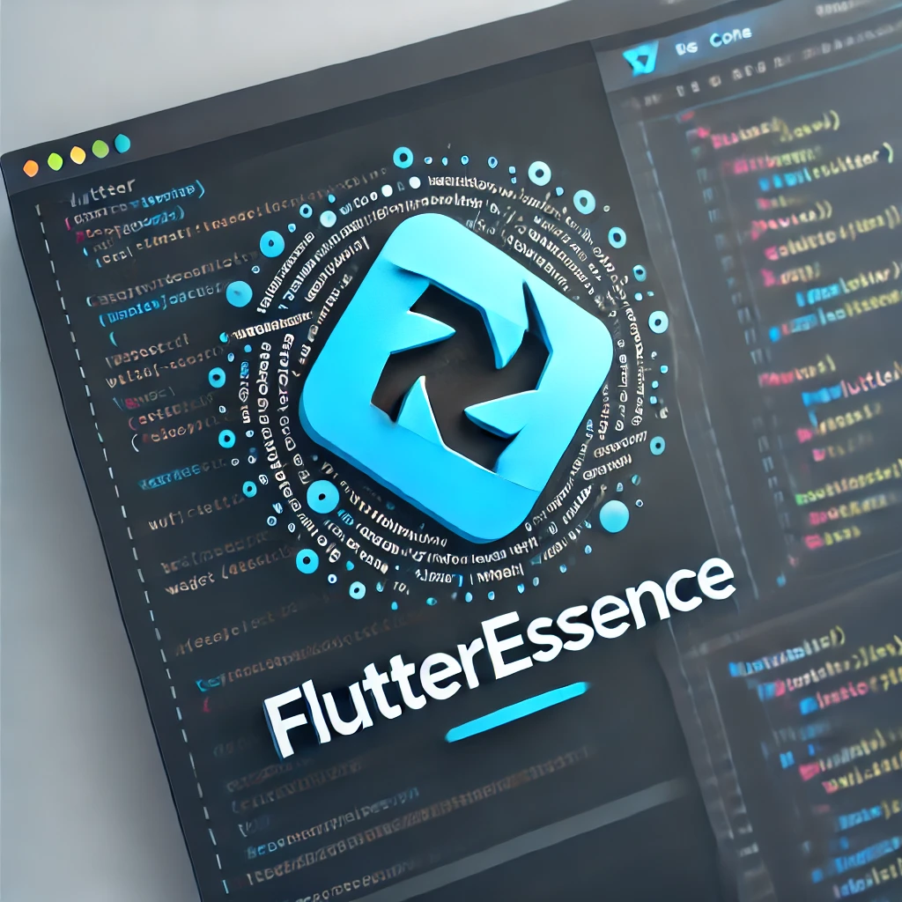

# FlutterEssence




FlutterEssence is a comprehensive collection of Flutter code snippets designed to enhance productivity and simplify the development process. Whether you're working on UI components, state management, animations, or custom widgets, FlutterEssence provides you with ready-to-use code snippets that follow best practices and are tailored to Flutter's core features.

## Features

- **69+ Code Snippets**: Covering a wide range of Flutter components, from basic widgets to complex layouts and animations.
- **Custom Widgets**: Easily integrate reusable custom components into your Flutter projects.
- **Form Handling**: Simplified form creation with validation, input fields, and more.
- **Navigation**: Efficiently manage app navigation with ready-to-use navigation snippets.
- **Animations**: Bring your app to life with Flutter's rich animation capabilities.
- **State Management**: Manage your app's state with snippets for `setState`, `InheritedWidget`, and more.

## Installation

To use the snippets provided by FlutterEssence, simply copy the relevant JSON snippet to your code editor's snippet manager. The snippets are designed to work seamlessly with Visual Studio Code, but can be adapted for use with other editors as well.

## Usage

Each snippet in FlutterEssence is prefixed with `fe` to distinguish them from other snippets. Below are some example snippets:

### Example Snippets

#### Container
```dart
Container(
  width: 100.0,
  height: 100.0,
  decoration: BoxDecoration(
    color: Colors.blue,
    borderRadius: BorderRadius.circular(8.0),
  ),
  child: Center(
    child: Text('Text', style: TextStyle(color: Colors.white)),
  ),
)
```

#### ElevatedButton
```dart
ElevatedButton(
  onPressed: () {
    // Add your onPressed code here!
  },
  child: Text('Button'),
)
```

#### Navigator Push
```dart
Navigator.push(
  context,
  MaterialPageRoute(builder: (context) => NextScreen()),
);
```

## Snippets List

### **Basic Widgets (UI Building Blocks)**
- `feContainer`: FlutterEssence Container
- `feText`: FlutterEssence Text
- `feIcon`: FlutterEssence Icon
- `feImage`: FlutterEssence Image
- `feScaffold`: FlutterEssence Scaffold
- `feAppBar`: FlutterEssence AppBar
- `feDrawer`: FlutterEssence Drawer
- `feBottomNavigationBar`: FlutterEssence BottomNavigationBar
- `feFloatingActionButton`: FlutterEssence FloatingActionButton
- `feCard`: FlutterEssence Card
- `feListTile`: FlutterEssence ListTile
- `feStack`: FlutterEssence Stack
- `feDivider`: FlutterEssence Divider
- `fePlaceholder`: FlutterEssence Placeholder
- `feChip`: FlutterEssence Chip
- `feTooltip`: FlutterEssence Tooltip
- `feBanner`: FlutterEssence Banner
- `feAlertDialog`: FlutterEssence AlertDialog
- `feSimpleDialog`: FlutterEssence SimpleDialog
- `feProgressBar`: FlutterEssence ProgressBar
- `feCircularProgressIndicator`: FlutterEssence CircularProgressIndicator
- `feLinearProgressIndicator`: FlutterEssence LinearProgressIndicator

### **Layout Widgets (Structure and Alignment)**
- `feColumn`: FlutterEssence Column
- `feRow`: FlutterEssence Row
- `feExpanded`: FlutterEssence Expanded
- `fePadding`: FlutterEssence Padding
- `feAlign`: FlutterEssence Align
- `feCenter`: FlutterEssence Center
- `feSizedBox`: FlutterEssence SizedBox
- `feFlex`: FlutterEssence Flex
- `feGridView`: FlutterEssence GridView
- `feListView`: FlutterEssence ListView
- `feFractionallySizedBox`: FlutterEssence FractionallySizedBox
- `feLimitedBox`: FlutterEssence LimitedBox
- `feConstrainedBox`: FlutterEssence ConstrainedBox
- `feFittedBox`: FlutterEssence FittedBox
- `feBaseline`: FlutterEssence Baseline
- `feSpacer`: FlutterEssence Spacer
- `feTable`: FlutterEssence Table
- `fePositioned`: FlutterEssence Positioned
- `feWrap`: FlutterEssence Wrap
- `feIndexedStack`: FlutterEssence IndexedStack
- `feIntrinsicHeight`: FlutterEssence IntrinsicHeight
- `feIntrinsicWidth`: FlutterEssence IntrinsicWidth
- `feOverflowBox`: FlutterEssence OverflowBox

### **Form Widgets (Input Handling)**
- `feTextField`: FlutterEssence TextField
- `feCheckbox`: FlutterEssence Checkbox
- `feRadio`: FlutterEssence Radio
- `feSwitch`: FlutterEssence Switch
- `feSlider`: FlutterEssence Slider
- `feDropdownButton`: FlutterEssence DropdownButton
- `feForm`: FlutterEssence Form
- `feDatePicker`: FlutterEssence DatePicker
- `feTimePicker`: FlutterEssence TimePicker
- `feStepper`: FlutterEssence Stepper
- `feTextFormFieldValidator`: FlutterEssence TextFormField with Validator

### **Custom Widgets**
- `feCustomButton`: FlutterEssence Custom Button
- `feCustomCard`: FlutterEssence Custom Card
- `feCustomDialog`: FlutterEssence Custom Dialog
- `feCustomAlert`: FlutterEssence Custom Alert
- `feCustomDrawer`: FlutterEssence Custom Drawer
- `feCustomBottomSheet`: FlutterEssence Custom BottomSheet
- `feCustomAppBar`: FlutterEssence Custom AppBar
- `feCustomForm`: FlutterEssence Custom Form
- `feCustomIcon`: FlutterEssence Custom Icon
- `feCustomTextField`: FlutterEssence Custom TextField
- `feCustomListItem`: FlutterEssence Custom ListItem
- `feCustomSlider`: FlutterEssence Custom Slider
- `feCustomSwitch`: FlutterEssence Custom Switch

## Contributing

Contributions are welcome! If you have a snippet you'd like to add or improvements to existing snippets, please open an issue or submit a pull request.

1. Fork the repository
2. Create your feature branch (`git checkout -b feature/YourFeature`)
3. Commit your changes (`git commit -m 'Add some feature'`)
4. Push to the branch (`git push origin feature/YourFeature`)
5. Open a pull request

## License

This project is licensed under the Apache License 2.0 - see the [LICENSE](LICENSE) file for details.

## Author

**Sitharaj Seenivasan**

- [GitHub](https://github.com/sitharaj88)
- [LinkedIn](https://linkedin.com/in/sitharaj08)


Thank you for using FlutterEssence! If you find this collection helpful, please give it a star ⭐ on GitHub.

